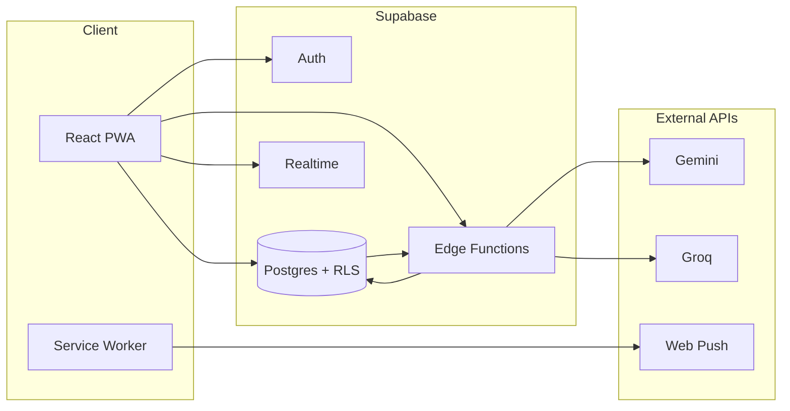

# Finlo

**Personal finance, built for speed.** Finlo is a mobile-first expense tracker and installable PWA that helps you log spending, set budgets, and understand your money—with optional AI for natural-language entry, receipt scanning, and conversational insights.

> For a full feature walkthrough, see [FEATURES.md](./FEATURES.md).

---

## Highlights

| Area | What you get |
|------|----------------|
| **Ledger** | Today, week, and month views · quick add · search & filters · soft-delete trash |
| **Categories & budgets** | Custom categories, subcategories, monthly caps, and safe-to-spend guidance |
| **Smart entry** | Natural-language parsing, receipt OCR, and voice input (via Edge Functions) |
| **Maya (AI)** | Chat assistant for spending questions and structured “add to Finlo” suggestions |
| **Subscriptions & recurring** | Track recurring bills, get reminders, auto-process due rules |
| **Loans** | Lent/borrowed tracking with partial repayments and interest |
| **Households** | Shared expenses, invites, goals, and partner notifications |
| **Data** | CSV/Excel import · JSON/CSV export · offline queue · Supabase sync |
| **PWA & mobile** | Installable web app · push notifications · Capacitor Android shell |

---

## Architecture



| Layer | Stack |
|-------|--------|
| **Frontend** | React 18 · TypeScript · Vite 5 · Tailwind CSS · shadcn/ui · Recharts |
| **Backend** | Supabase (Postgres, Auth, Realtime, Storage) |
| **Edge** | Supabase Edge Functions (Deno) |
| **PWA** | `vite-plugin-pwa` · Workbox · custom service worker |
| **Mobile** | Capacitor 8 (Android) |

---

## Prerequisites

- **Node.js** 18+ (20+ recommended)
- **npm** (or a compatible package manager)
- A **Supabase** project ([create one free](https://supabase.com/dashboard))
- Optional: [Supabase CLI](https://supabase.com/docs/guides/cli) for migrations and function deploys

---

## Quick start

### 1. Clone and install

```bash
git clone <your-repo-url> finlo
cd finlo
npm install
```

### 2. Configure environment

```bash
cp .env.example .env
```

Edit `.env` with your Supabase project values (Dashboard → **Settings → API**):

| Variable | Description |
|----------|-------------|
| `VITE_SUPABASE_URL` | Project URL |
| `VITE_SUPABASE_PUBLISHABLE_KEY` | Publishable (anon) key — safe for the browser |
| `VITE_SUPABASE_PROJECT_ID` | Project reference ID |
| `VITE_VAPID_PUBLIC_KEY` | Optional — required for push notifications |

> **Never** put service-role keys or model API keys in `VITE_*` variables. See [SECURITY.md](./SECURITY.md).

### 3. Set up Supabase

**Apply migrations** (pick one approach):

```bash
# With Supabase CLI (linked project)
supabase db push

# Or run SQL files manually in Dashboard → SQL Editor
# from supabase/migrations/ in timestamp order
```

**Deploy Edge Functions:**

```bash
supabase functions deploy
```

**Configure secrets** in Dashboard → **Edge Functions → Secrets** (see [Environment & secrets](#environment--secrets) below).

**Seed push notification DB secrets** (after migrations):

```bash
# Edit placeholders first, then run in SQL Editor:
# supabase/seed-app-secrets.example.sql
```

**Bootstrap admin** (first install only):

```bash
# Set SEED_ADMINS + SEED_BOOTSTRAP_SECRET in Dashboard, deploy seed-admin, then:
npm run seed-admin
```

### 4. Run locally

```bash
npm run dev
```

Open [http://localhost:8080](http://localhost:8080).

### 5. Verify

```bash
npm run typecheck
npm run lint
npm test
npm run build
```

---

## Environment & secrets

### Client (`.env` — gitignored)

Only **publishable** values belong here. Copy from `.env.example`.

### Edge Functions (Supabase Dashboard secrets)

| Secret | Used by | Required |
|--------|---------|----------|
| `GEMINI_API_KEY` | `ask-data`, `nl-parse-expense` | For AI features |
| `GROQ_API_KEY` | `ask-data`, `nl-parse-expense` | For AI features (fallback / voice) |
| `LOVABLE_API_KEY` | `parse-receipt`, `suggest-category`, `spending-insights` | For receipt & category AI |
| `ALLOWED_ORIGINS` | CORS helpers | Production |
| `CRON_SECRET` | `process-recurring` | Scheduled jobs |
| `VAPID_PUBLIC_KEY` | `send-push` | Push notifications |
| `VAPID_PRIVATE_KEY` | `send-push` | Push notifications |
| `VAPID_MAILTO` | `send-push` | Push notifications |
| `SEED_ADMINS` | `seed-admin` | Initial admin bootstrap |
| `SEED_BOOTSTRAP_SECRET` | `seed-admin` | First-install bootstrap |

Supabase injects `SUPABASE_URL`, `SUPABASE_ANON_KEY`, and `SUPABASE_SERVICE_ROLE_KEY` into Edge Functions automatically.

### Database (`public.app_secrets`)

Used by Postgres triggers for server-side push delivery. See `supabase/seed-app-secrets.example.sql`.

---

## Edge Functions

| Function | Purpose |
|----------|---------|
| `ask-data` | Maya AI chat — spending Q&A and action suggestions |
| `nl-parse-expense` | Natural-language and voice expense parsing |
| `parse-receipt` | Receipt image → structured transaction |
| `suggest-category` | AI category suggestions |
| `spending-insights` | Personalized spending analysis |
| `process-recurring` | Creates expenses from due recurring rules |
| `check-reminders` | Subscription and loan reminder checks |
| `check-subscriptions` | Recurring subscription detection |
| `send-push` | Web push notification delivery |
| `generate-pulse` / `household-pulse` | Household activity summaries |
| `notify-household-invite` | Invite notification delivery |
| `respond-to-invite` / `leave-household` | Household membership actions |
| `seed-admin` | One-shot admin user bootstrap |
| `admin-create-user` / `admin-list-users` / `admin-update-user` | Admin user management |

Shared helpers live in `supabase/functions/_shared/`.

---

## Scripts

| Command | Description |
|---------|-------------|
| `npm run dev` | Start Vite dev server (port 8080) |
| `npm run build` | Production build to `dist/` |
| `npm run preview` | Preview production build locally |
| `npm run typecheck` | TypeScript check |
| `npm run lint` | ESLint |
| `npm test` | Vitest (single run) |
| `npm run test:watch` | Vitest watch mode |
| `npm run seed-admin` | Call `seed-admin` Edge Function (bootstrap) |

Additional tooling in `scripts/`:

- `seed-admin-bootstrap.mjs` — first-install admin seed (used by `npm run seed-admin`)
- `push-users.mjs` — create users via Auth Admin API (requires `SEED_ADMINS` or `--users-file`; never commit credentials)

---

## Production & PWA

```bash
npm run build
npm run preview   # optional smoke test of dist/
```

The service worker registers from `src/main.tsx` in production. The web app manifest and icons are generated during build via `vite-plugin-pwa`.

### Android (Capacitor)

An Android project lives in `android/`. After a web build:

```bash
npx cap sync android
npx cap open android
```

Signing keys and release artifacts are gitignored — configure them locally in Android Studio.

---

## Project structure

```
finlo/
├── src/
│   ├── pages/           # Login, Index (main ledger), Admin, NotFound
│   ├── components/      # UI, sheets, drawers, charts
│   ├── hooks/           # Auth, expenses, PWA, offline
│   ├── lib/             # Business logic, AI actions, utilities
│   └── integrations/    # Supabase client & types
├── supabase/
│   ├── migrations/      # Postgres schema, RLS, triggers
│   ├── functions/       # Edge Functions (Deno)
│   └── seed-app-secrets.example.sql
├── public/              # Static assets, icons
├── scripts/             # Admin bootstrap & user tooling
├── android/             # Capacitor Android shell
├── FEATURES.md          # Detailed feature documentation
├── CONTRIBUTING.md      # Contribution guidelines
└── SECURITY.md          # Secrets policy & vulnerability reporting
```

---

## Contributing

Contributions are welcome — bug fixes, docs, tests, and features.

1. Read [CONTRIBUTING.md](./CONTRIBUTING.md)
2. Fork, branch, and open a pull request
3. Run `typecheck`, `lint`, `test`, and `build` before submitting

## Security

Do **not** commit `.env`, API keys, passwords, or Supabase CLI temp state. Report vulnerabilities privately — see [SECURITY.md](./SECURITY.md).

## License

No license file is included yet. Add a `LICENSE` (e.g. MIT, Apache 2.0) before distributing or accepting external contributions under specific terms.
